# Créer un cluster DKS (console Door)

Guide **formateur** et stagiaire curieux. La console est en **anglais** : les libellés ci-dessous sont ceux de l’interface, suivis d’une courte explication en français.

Le Lab 1 en salle **ne crée pas** un cluster par personne : le formateur prépare des clusters binômes `lab-binome-1` … `lab-binome-5`. Chaque stagiaire, **Member** de l’organisation, télécharge le kubeconfig (voir [dks-kubeconfig.md](dks-kubeconfig.md) et [kubernetes/lab01-cluster-dks/README.md](../kubernetes/lab01-cluster-dks/README.md)).

---

## Compte et organisation

1. Ouvrez [https://door.cloud](https://door.cloud). Vous êtes redirigé vers **Door Authentication** (`https://auth.door.cloud`).
2. Titre **Connect to Door**. E-mail + mot de passe (placeholder *your.email@company.com* / *Enter your password*), bouton **Continue**. Alternative : **Continue with Google**.

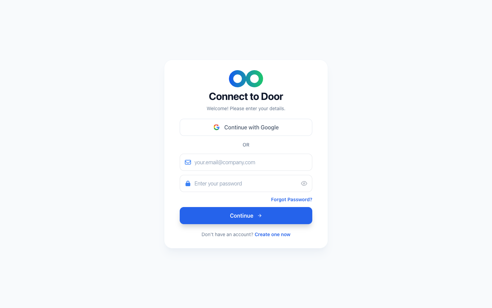

3. Après connexion, le tableau de bord **Welcome to Door** s’affiche (raccourcis **Clusters**, **IAM**, **Maya Assistant**, etc.).

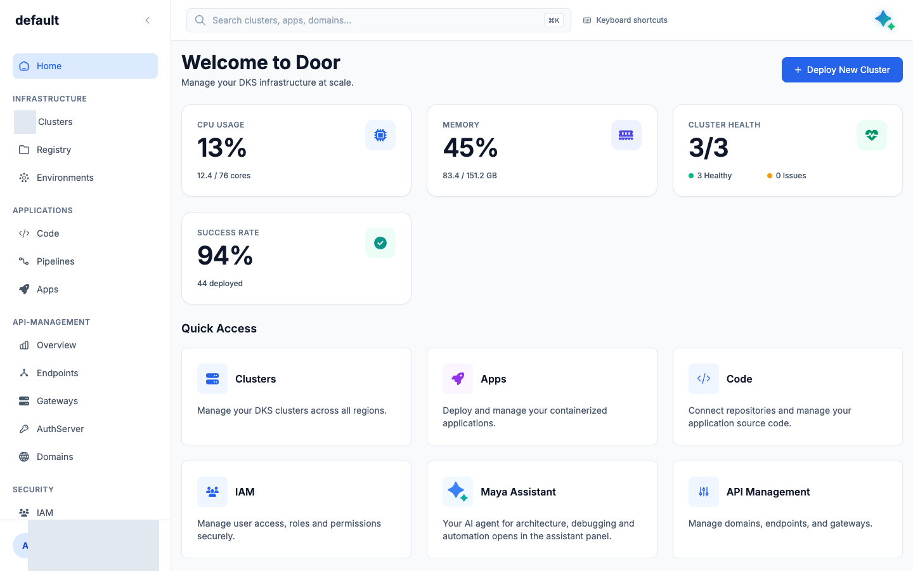

### Organisation et rôles

Une **organisation dédiée à la formation** (plan Team ou Enterprise) : pas le workspace Personnel, qui n’invite pas.

| Rôle UI | Qui | Droits cluster DKS |
|---|---|---|
| **Super Admin** | formateur | **Create Cluster**, supprimer, IAM |
| **Member** (défaut à l’invitation) | stagiaires | lister les clusters, **Download kubeconfig** — **pas** créer ni supprimer |

Invitations : sidebar **SECURITY** → **IAM** (`/iam`), titre **Identity & Access Management**, bouton **Invite Member**. Dialog **Invite members to join your organization**. Ne donnez pas Super Admin à toute la salle.

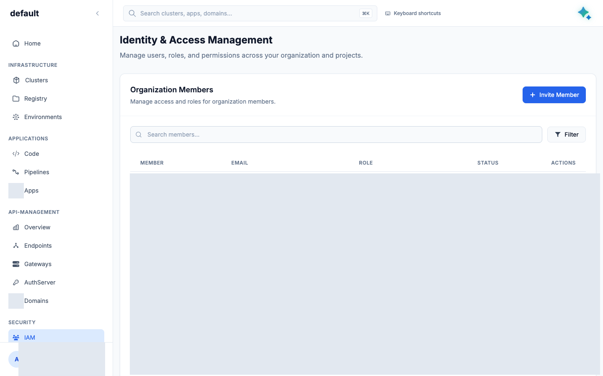

La langue de la console n’est **pas** traduite en français. Coller les libellés anglais tels quels.

---

## Liste des clusters

Sidebar **INFRASTRUCTURE** → **Clusters** (`/dks/clusters`).

- Titre **Clusters**
- Sous-titre **Manage and monitor your Kubernetes clusters**
- Bouton **New Cluster**

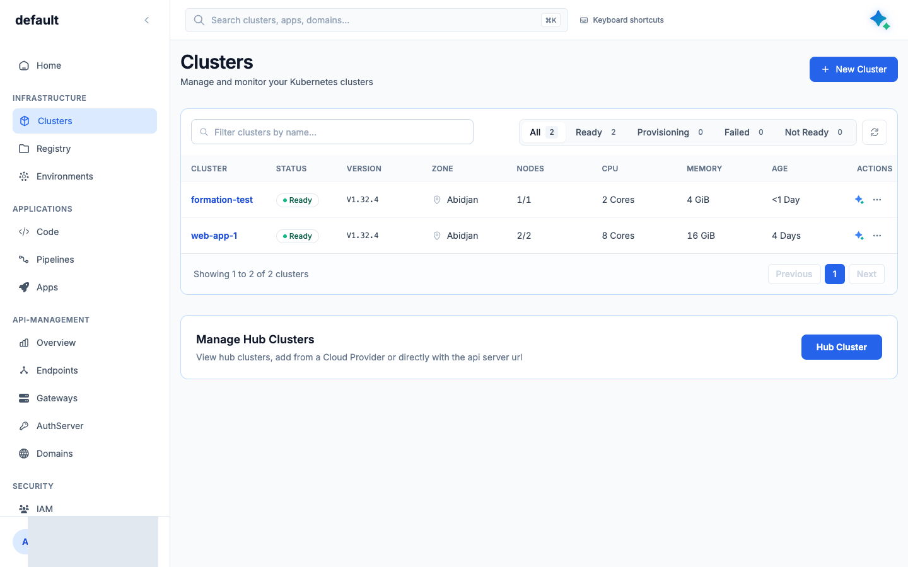

---

## Assistant en 3 étapes (**Create a Cluster**)

**New Cluster** ouvre `/dks/clusters/new`. Titre **Create a Cluster**. Sous-titre : *Configure your Kubernetes environment. You can modify most of these settings later.*

La console Live utilise le **wizard 3 étapes** (pas le Composer une page).

### Dimensionnement formation (obligatoire)

Le défaut UI (**Replicas** 3 × machine **c5.xlarge** *Recommended*) consomme trop d’instances OpenStack. Pour un cluster de lab : **1 seul worker, mais en c5.xlarge** — la plateforme Door (Cilium, Trident, gateway, monitoring) réserve déjà ~0,6 vCPU et ~2 Go sur chaque nœud ; sur un c5.large (4 Go) il ne reste pas assez de place pour les labs d’un binôme.

| Champ | Valeur |
|---|---|
| **Zone** | **Abidjan** |
| **Replicas** | **1** (pas 3) |
| **Machine type** | **c5.xlarge** (4 vCPU · 8 GB) — le *Recommended*, mais avec **1 replica** |
| API Kubernetes | **Public** (défaut Live) — indispensable pour `kubectl` depuis un laptop |
| Dataplane apps | **Internet** (défaut) — distinct de l’API ; figé à la création |

Quota : **au plus 4 créations en parallèle** par zone. Au-delà, les demandes attendent. Prévoir **7–9 minutes** jusqu’à un cluster joignable par `kubectl` (l’UI affiche souvent « ~5 minutes » : trop optimiste), puis **60–90 minutes** de plus pour que la plateforme Door finisse de s’installer (door-system, door-apigateway, door-monitoring, CSI Trident : images tirées depuis Docker Hub, lentes depuis Abidjan). D’où la règle : **créer les clusters binômes la veille**.

### Étape 1 — **General Information**

*Basic details for your cluster.*

- **Cluster Name \*** — RFC1123 : 1–63, minuscules, chiffres, tirets. Exemple formation : `lab-binome-1`.
- **Zone \*** — **Abidjan · Côte d'Ivoire**.
- **Kubernetes Version \*** — catalogue Live : **1.32.4 (Recommended)** (`v1.32.4`).
- **Next** / **Cancel**.

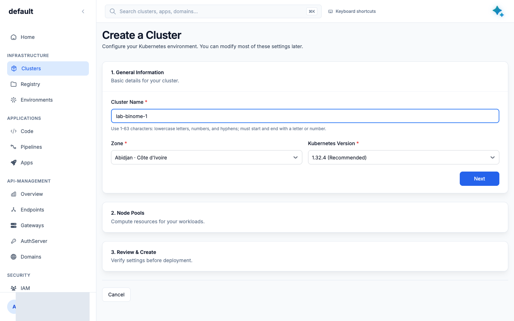

### Étape 2 — **Node Pools**

*Compute resources for your workloads.* Carte **Node pool 1** :

- **Pool name** — défaut `default`
- **Replicas** — **1** (curseur **−** / **+**, plage 1–200)
- **Machine type** — garder **c5.xlarge** (*Recommended*) ; c’est le nombre de replicas qu’on réduit, pas la taille
- **+ Add node pool** — inutile pour le lab (1 pool suffit)
- **Next**

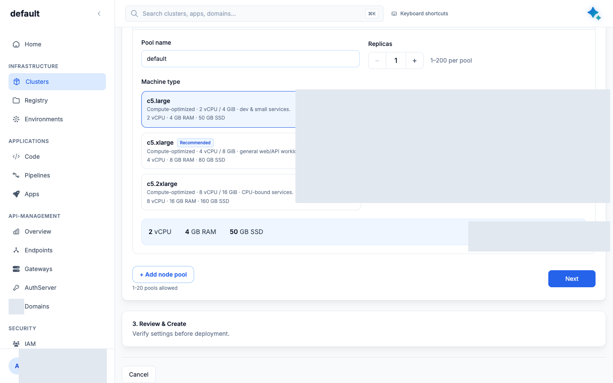

### Étape 3 — **Review & Create**

*Verify settings before deployment.*

Vérifiez **Name / Zone / Version / Nodes / Sizing** : `lab-binome-1`, Abidjan, `v1.32.4`, `default · 1 x c5.xlarge`.

- **Where can your applications be reached?** — **Internet** vs **Internal (VPN)**. *Set once and cannot be changed after the cluster is created.* C’est le **réseau des applications**, pas l’accès à l’API Kubernetes (public par défaut, basculable plus tard).
- Bannière de provisioning (l’UI parle de **~5 minutes** / control plane **~3 min**) : en pratique **7–9 min** jusqu’à cluster prêt.
- Bouton bleu **Create Cluster** (puis **Creating…**).

Les montants affichés dans **Estimated cost** dépendent du catalogue : ne les recopiez pas dans un compte rendu.

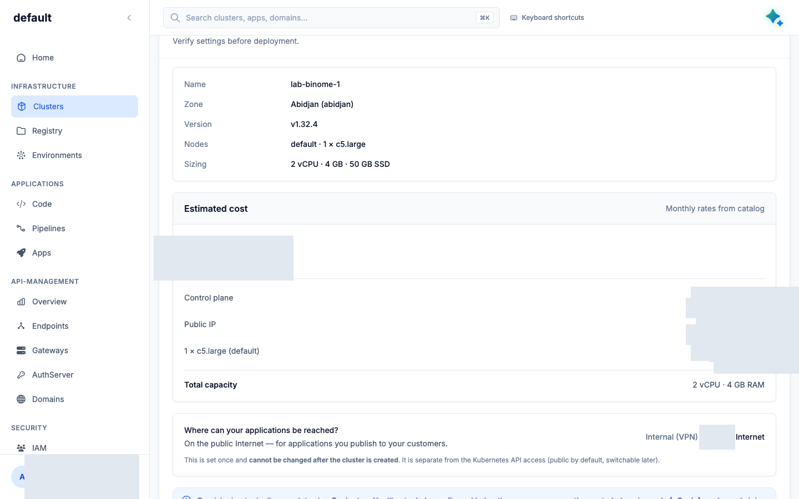

**Create Cluster** exige **Super Admin**. Sur une org prepaid, l’UI peut afficher **Prepaid credits required** / **Add credits** / **Add card** et bloquer le bouton : arrêtez-vous et prévenez le formateur (ne pas saisir de carte « pour voir »).

---

## Provisioning (après **Create Cluster**)

Navigation vers `/dks/clusters/provisioning/…`. Cinq étapes (libellés serveur) :

1. **Request received**
2. **Validating configuration**
3. **Creating infrastructure**
4. **Control plane ready** (puis éventuellement **Worker nodes ready**)
5. **Cluster ready**

Carte **While you wait** : bouton **Install Kubeconfig** dès que le control plane est prêt. Compteur **Elapsed**. **API access** doit rester **Public endpoint**.

Côté API, le succès terminal s’appelle **Provisioned** (pas `Ready`). Durée observée : **7–9 minutes**. `Provisioned` ne veut pas dire « plateforme installée » : comptez encore 60–90 min avant que Trident (lab 7) réponde — vérifiez `kubectl -n kube-system get pods -l app=controller.csi.trident.netapp.io`. Suppression : **2–4 minutes**.

---

## Après le cluster : aperçu, nœuds, kubeconfig, Settings

Onglets d’un cluster (`/dks/clusters/…`) : **Overview** · **Nodes** · **Networking** · **Access & kubeconfig** · **Settings**.

**Overview** : version, zone, réseau, ressources.

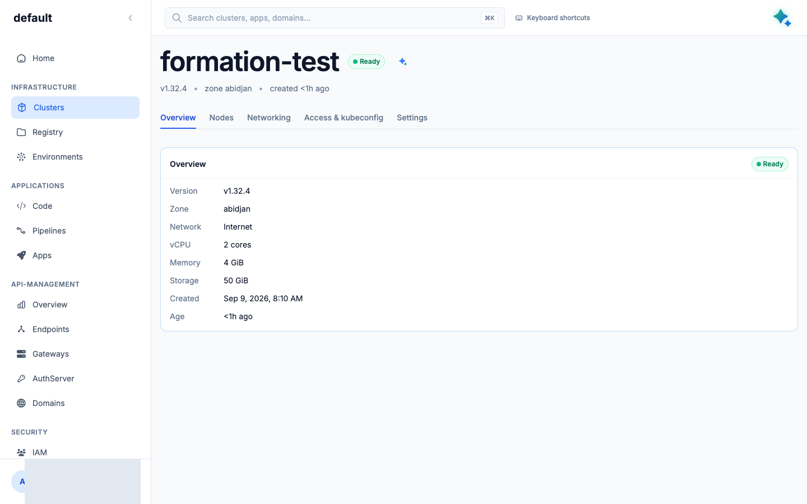

**Nodes** : pool `default`, **Replicas**, type de machine. Ne pas cliquer **+ Add node pool** ni supprimer des nœuds en séance.

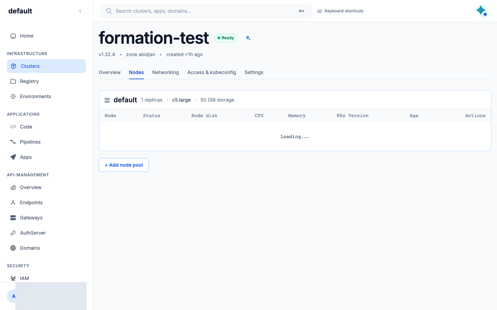

**Access & kubeconfig** : toggle **Private** / **Public**, bouton **Download kubeconfig**. Détail dans [dks-kubeconfig.md](dks-kubeconfig.md). **Laisser Public** pour la salle.

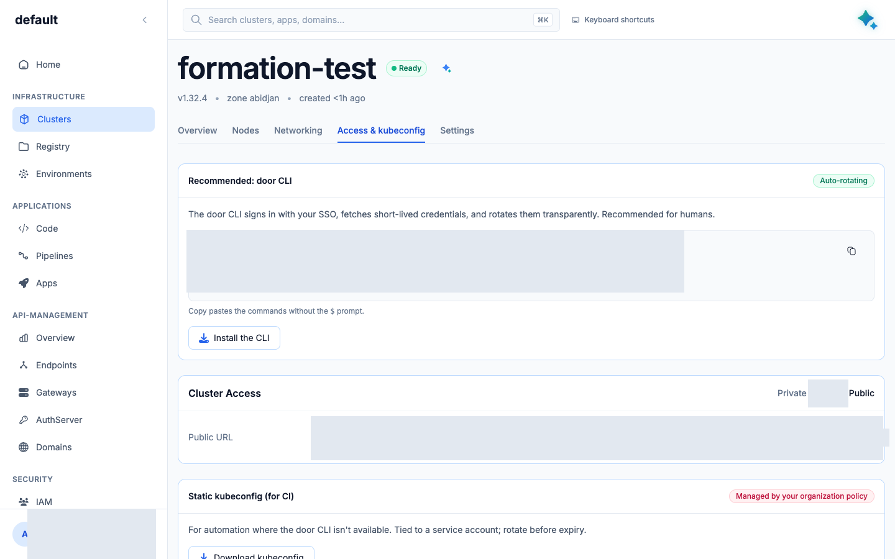

**Settings** : **Danger zone** → **Delete cluster** / **Delete**. Ne jamais supprimer un cluster `prod-*` / `uat-*`, ni un cluster qui n’est pas le vôtre.

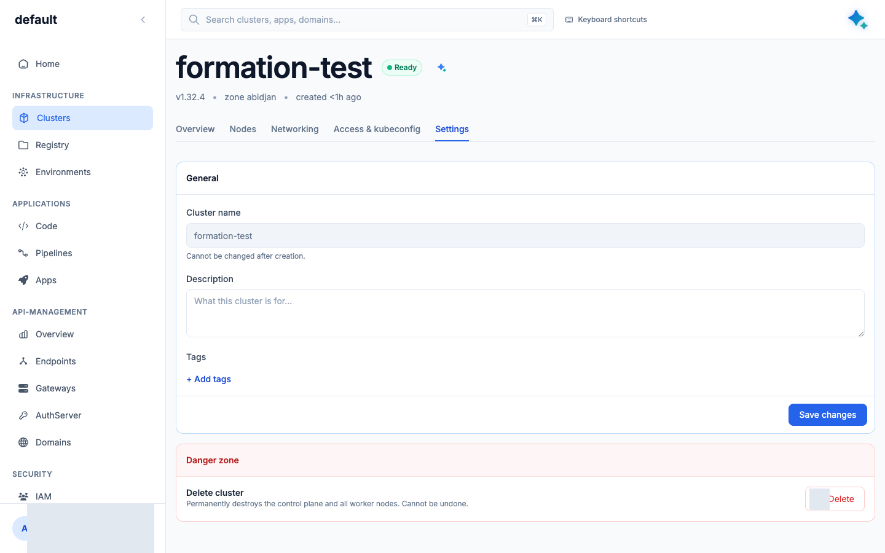

---

## Glossaire (FR → libellé UI)

| FR formation | UI |
|---|---|
| Nouveau cluster | **New Cluster** |
| Créer un cluster | **Create Cluster** |
| Télécharger le kubeconfig | **Download kubeconfig** / **Install Kubeconfig** |
| Rendre l’API publique | Toggle **Public** (**Access & kubeconfig**) |
| Supprimer | **Delete cluster** |
| Inviter | **Invite Member** |
| Réseau privé (apps) | **Internal (VPN)** |
| Internet (apps) | **Internet** |

---

<details>
<summary>Équivalent API (formateur, placeholders uniquement)</summary>

Surface client : `https://dks-api.apps.door.cloud`, chemins `/v1/public/…`. En-tête `X-Door-Organization`. Jeton Firebase Bearer. **Aucune valeur réelle** dans ce dépôt.

```bash
TOKEN=$TOKEN          # jeton Bearer, jamais commité
ORG=$ORG              # nom d'organisation, ex. formation-k8s
API=https://dks-api.apps.door.cloud

# Catalogue (versions, tailles, défauts)
curl -sS -H "Authorization: Bearer $TOKEN" \
  "$API/v1/catalog?zone=abidjan&organization=$ORG"

# Créer (rôle super_admin). Taille = palier public, 1 worker c5.xlarge.
curl -sS -X POST -H "Authorization: Bearer $TOKEN" \
  -H "Content-Type: application/json" \
  -H "Idempotency-Key: $(uuidgen)" \
  -H "X-Door-Organization: $ORG" \
  -d '{
    "name": "lab-binome-1",
    "organization": "'"$ORG"'",
    "zone": "abidjan",
    "kubernetes_version": "v1.32.4",
    "exposure_mode": "public",
    "network_mode": "internet",
    "node_pools": [{"name": "default", "size": "dks.c5.xlarge", "count": 1}]
  }' \
  "$API/v1/public/clusters"

# Suivre jusqu'à phase=Provisioned
curl -sS -H "Authorization: Bearer $TOKEN" \
  "$API/v1/public/clusters/$ID/state"

# Kubeconfig (répéter si HTTP 202)
curl -sS -D - -H "Authorization: Bearer $TOKEN" \
  "$API/v1/public/clusters/$ID/kubeconfig?format=plain" \
  -o lab-binome-1-kubeconfig.yaml

# Forcer l'API publique puis re-télécharger le kubeconfig
curl -sS -X PATCH -H "Authorization: Bearer $TOKEN" \
  -H "Content-Type: application/json" \
  -d '{"exposure_mode":"public"}' \
  "$API/v1/public/clusters/$ID/exposure"

# Lister
curl -sS -H "Authorization: Bearer $TOKEN" \
  "$API/v1/public/clusters?page=1&size=50"

# Supprimer (HTTP 202, asynchrone)
curl -sS -X DELETE -H "Authorization: Bearer $TOKEN" \
  "$API/v1/public/clusters/$ID"
```

Contraintes : nom RFC1123 ; 1–20 pools ; 1–200 nœuds/pool ; `Idempotency-Key` 8–255 caractères ; 409 si le nom existe ; **402** si crédit prepaid insuffisant.

</details>
